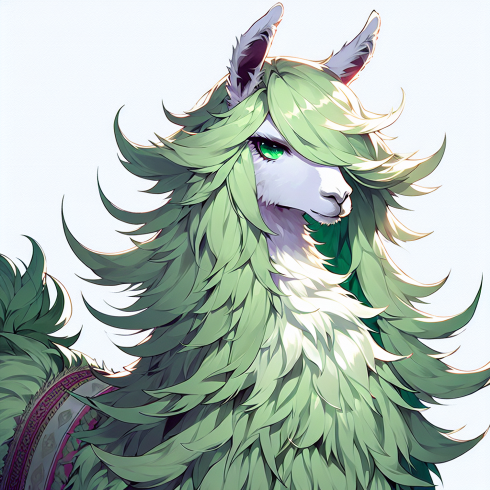

# GlotCC

 

<a href="https://huggingface.co/datasets/cis-lmu/GlotCC-V1"></a>
<a href="https://github.com/cisnlp/GlotCC/blob/main/LICENSE"></a>
<!---
<a href="."></a>
<a href="https://arxiv.org/abs/xxxx.xxxxx"></a>
-->
</p>


**GlotCC is a multilingual corpus built by the GlotLID language identification and Ungoliant pipeline from CommonCrawl.** 

Current version ([V1](https://huggingface.co/datasets/cis-lmu/GlotCC-V1)) supports more than **1000 languages** and is filtered based on adopted filters from C4, CCNet, MADLAD-400, RedPajama-Data-v2, OSCAR, Gopher, RefinedWeb, FineWeb, Datatrove, Dolma, Pile-CC, Pretrainer's Guide, and GlotScript.

<a href="https://github.com/cisnlp/GlotLID"></a> \
<a href="https://github.com/kargaranamir/ungoliant"></a> </br>

™ The logo features a llama with the style of C.C. from the Code Geass.


## Dataset

### Statistics of the dataset

## Running the pipeline

We provide guidance on how to run the pipeline at [kargaranamir/ungoliant](https://github.com/kargaranamir/ungoliant). The readme is up-to-date.

## Summary of Quality Signals

## Acknowledgements

- We appreciate the collaborators who are collectively advancing the frontier of open datasets and LLM models.
- Thanks to the community and friends who enable the auditing of this dataset with higher quality. Also, to everyone contributing to the GlotCC dataset.
- Our gratitude extends to the exceptional team at OSCAR for leading the development of open piplines and datasets from CommonCrawl, and to the remarkable team at CommonCrawl.


## License

- GlotCC data is released under the following licensing scheme: We do not own any of the text from which this data has been extracted. The data is licensed under the terms of the CommonCrawl [Terms of Use](https://commoncrawl.org/terms-of-use). We license the actual packaging, metadata, and annotations of this data under the Creative Commons [CC0 license](https://github.com/cisnlp/GlotCC/blob/main/LICENSE).
- Ungoliant license remains unchanged as the [Apache License 2.0](https://github.com/kargaranamir/ungoliant/blob/main/LICENSE).
- GlotLID license remains unchanged as the [Apache License 2.0](https://github.com/cisnlp/GlotLID/blob/main/LICENSE).

## Citation

If you find our repo and data useful for your research, please cite:

GlotCC Dataset:

```js
@article{kargaran2024glotcc,
title        = {Glot{CC}: An Open Broad-Coverage CommonCrawl Corpus and Pipeline for Minority Languages},
author       = {Kargaran, Amir Hossein and Yvon, Fran{\c{c}}ois and Sch{\"u}tze, Hinrich},
journal      = {arXiv preprint},
year         = {2024},
url          = {https://github.com/cisnlp/GlotCC/}
}
```

GlotLID Language Identification:
```js
@inproceedings{kargaran2023glotlid,
title        = {Glot{LID}: Language Identification for Low-Resource Languages},
author       = {Kargaran, Amir Hossein and Imani, Ayyoob and Yvon, Fran{\c{c}}ois and Sch{\"u}tze, Hinrich},
year         = 2023,
booktitle    = {The 2023 Conference on Empirical Methods in Natural Language Processing},
url          = {https://openreview.net/forum?id=dl4e3EBz5j}
}
```

