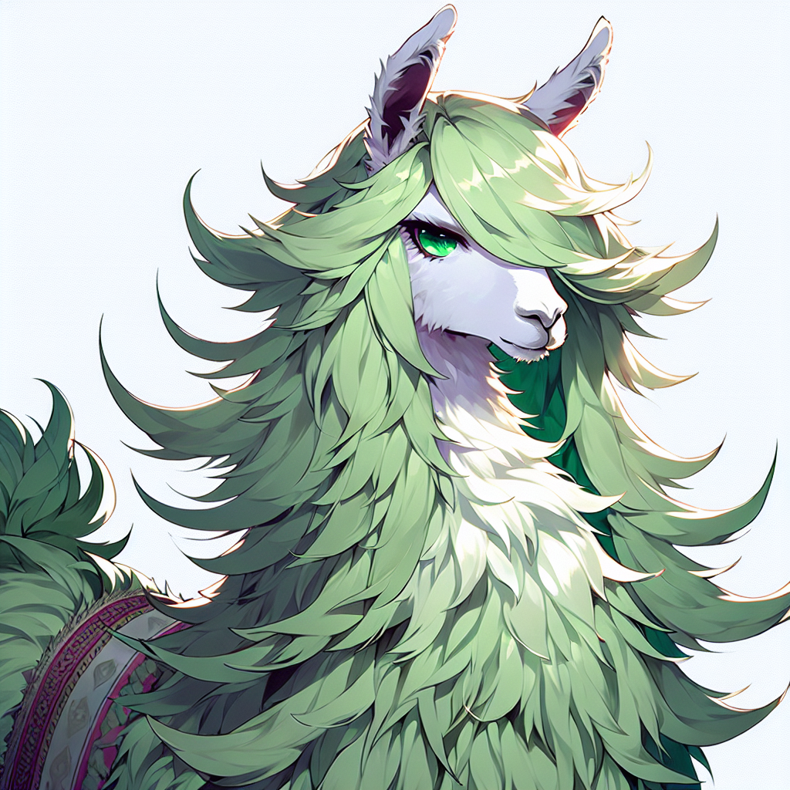

# GlotCC

 

**GlotCC is a multilingual corpus built by the GlotLID language identification and Ungoliant pipeline from CommonCrawl.** 

Current version supports **1000 languages** and is filtered based on adopted filters from C4, CCNet, MADLAD-400, RedPajama-Data-v2, OSCAR, Gopher, RefinedWeb, FineWeb, Datatrove, Dolma, Pile-CC, Pretrainer's Guide, and GlotScript.

™ The logo features a llama with the style of [C.C.](https://codegeass.fandom.com/wiki/C.C.) from the Code Geass anime.

  
  

## Dataset

### Statistics of the dataset

## Running the pipeline

## Summary of Quality Signals

## Acknowledgements

## License

## Citation
