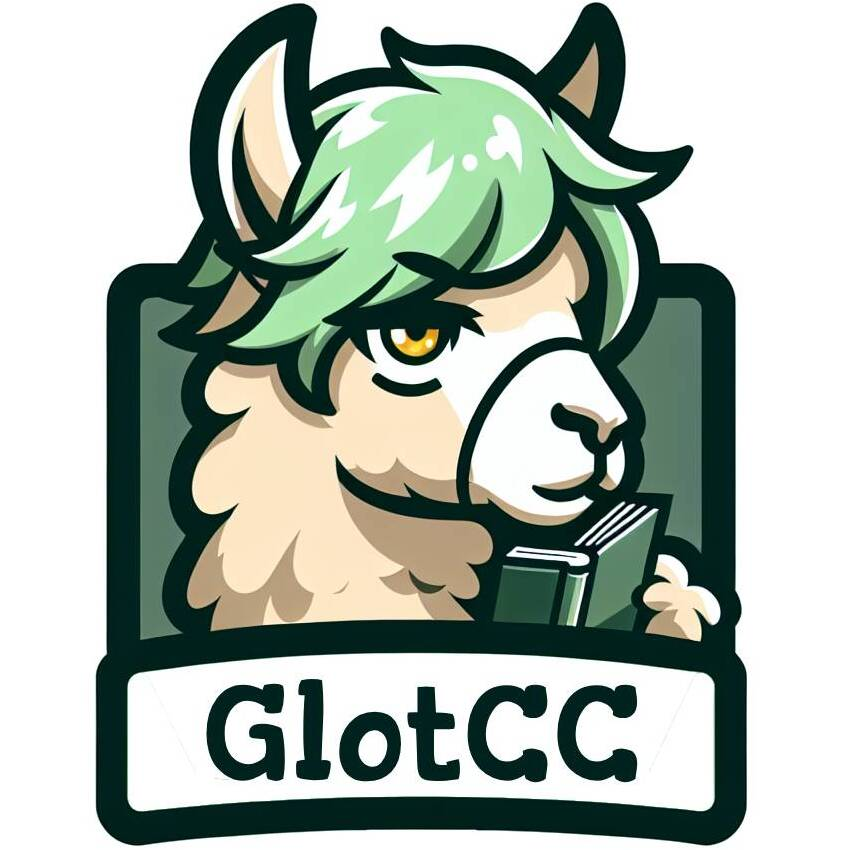

# GlotCC HomePage

 

<a href="https://arxiv.org/abs/2410.23825"></a>


**GlotCC is a multilingual corpus built by the GlotLID language identification and cisnlp/Ungoliant pipeline from CommonCrawl.** 

Lastest version supports more than **1000 languages** and is filtered based on adopted filters from C4, CCNet, MADLAD-400, RedPajama-Data-v2, OSCAR, Gopher, RefinedWeb, FineWeb, Datatrove, Dolma, Pile-CC, Pretrainer's Guide, and GlotScript. ™ The logo features a llama with the style of C.C. from the Code Geass anime reading a book.

## Dataset 

GlotCC Dataset, Version 1: [https://huggingface.co/datasets/cis-lmu/GlotCC-V1](https://huggingface.co/datasets/cis-lmu/GlotCC-V1)


## Running the pipeline

We forked oscar-project/ungoliant to cisnlp/ungoliant and made the necessary changes to integrate it with the [GlotLID](https://github.com/cisnlp/glotlid) language identification model.

For detailed instructions on running the pipeline, refer to the [cisnlp/ungoliant repository](https://github.com/cisnlp/ungoliant). The README is up-to-date.

## Acknowledgements

- We appreciate the collaborators who are collectively advancing the frontier of open datasets and LLM models.
- Thanks to the community and friends who enable the auditing of this dataset with higher quality. Also, to everyone contributing to the GlotCC dataset.
- Our gratitude extends to the OSCAR team for pioneering the development of open pipelines and datasets from CommonCrawl, as well as to the CommonCrawl team.

## License

- GlotCC data is released under the following licensing scheme: We do not own any of the text from which this data has been extracted. The data is licensed under the terms of the CommonCrawl [Terms of Use](https://commoncrawl.org/terms-of-use). We license the actual packaging, metadata, and annotations of this data under the Creative Commons [CC0 license](https://github.com/cisnlp/GlotCC/blob/main/LICENSE).
- Ungoliant license remains unchanged as the [Apache License 2.0](https://github.com/cisnlp/ungoliant/blob/main/LICENSE).
- GlotLID license remains unchanged as the [Apache License 2.0](https://github.com/cisnlp/GlotLID/blob/main/LICENSE).

## Citation

If you find our repo and data useful for your research, please cite:

```
@article{kargaran2024glotcc,
  title     = {Glot{CC}: An Open Broad-Coverage CommonCrawl Corpus and Pipeline for Minority Languages},
  author    = {Kargaran, Amir Hossein and Yvon, Fran{\c{c}}ois and Sch{\"u}tze, Hinrich},
  journal   = {Advances in Neural Information Processing Systems},
  year      = {2024},
  url       = {https://arxiv.org/abs/2410.23825}
}
```


